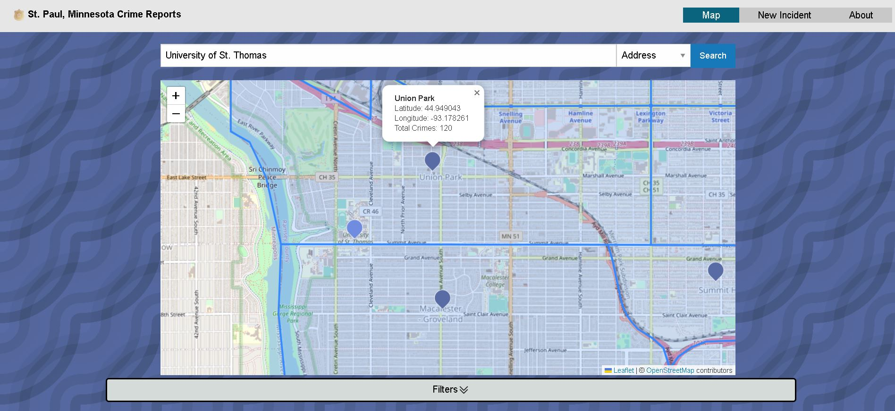

## St. Paul Crime VueJS User Interface

See it in action online by clicking [here](https://tuck1297.github.io/Vue-Single-Page-St.-Paul-Crime/)!!!

This repository holds the user interface that interacts with a RESTful-API located in [this](https://github.com/tuck1297/crime-restful-api) repository. It is focused on displaying a user interface that displays the crime data retrieved by the RESTful-API in the browser so it is easier to organize, categorize and filter through the crime information.

In this application there are two ways to visualize the data. There is either on the map or in the table below. The table below displays more specific information about each crime incident whereas the map allows a more generalization of all the crimes displayed in the table. Crimes will appear in the table below only if its cooresponding neighborhood marker is visible in the map above. There are many possibilities of data one can search with this tool. 

---

### Brief Project overview

The following is a brief list of what was implemented while creating this user interface: 

1. Show a map using the Leaflet API
    - Pan and zoom available with mouse click-and-drag and scroll wheel interaction
    - Limit the map so it cannot go outside the bounds of St. Paul
    - Have an input box and 'GO' button for a user to type a location address or lat/long coordinates
    - Use the Nominatim API to convert between address and lat/long
    - Clamp input values if lat/long is outside of the St. Paul's bounding box
    - Markers on the map for each neighborhood, or every click, and when specific crime addresses are clicked in the table below
2. Retrieve data from the St. Paul Crime API
    - By default include 1,000 most recent crimes in the database (online demo only does 100 to limit requests)
    - Populate a table with one row per crime (most recent being on top)
    - Crimes in table are only visible if cooresponding neighborhood marker is visible in above map
    - Update neighborhood tags display based on current location that is seen
3. New Incident upload form
    - Create a user input form for users to add a new crime incident to the database (PUT request)
    - Ensure all fields are fulled out before submitting request
4. "About the Project" page
    - Short bio about each team member (team member info removed for privacy reasons)
    - Description of tools (frameworks, APIS, etc.) you used to create the application
5. Create UI controls to filter crime data
    - Filter based on the following
    - 1. incident type
    - 2. neighborhood_name
    - 3. time range
    - 4. max incidents

---

# Plug and Play

To use this project you will need to do the following: 

1. Clone and load the St. Paul Crime Restful-API into your Integrated development environment (IDE) from [this](https://github.com/tuck1297/crime-restful-api) repo
1. Clone this project into your IDE
2. Navigate to the file directory that holds this project in your IDE
3. Install project dependencies by typing the following in the terminal: 
```npm install```
4. Run the project by typing the following in the terminal: 
``` npm run dev -- --port 5500 ```
5. Navigate to your browser and type the following: 
``` http://localhost:5500/ ```

NOTE: These instructions involve running two separate projects locally at the same time. The Restful API is programmed to run on port 8000 so this is why port 5500 is chosen in the instructions above.

---

## Languages and Tools Used
<div>
  &nbsp;
  &nbsp;
  &nbsp;
  
  
  
  
  
  
  
    
    
    
    
</div>
